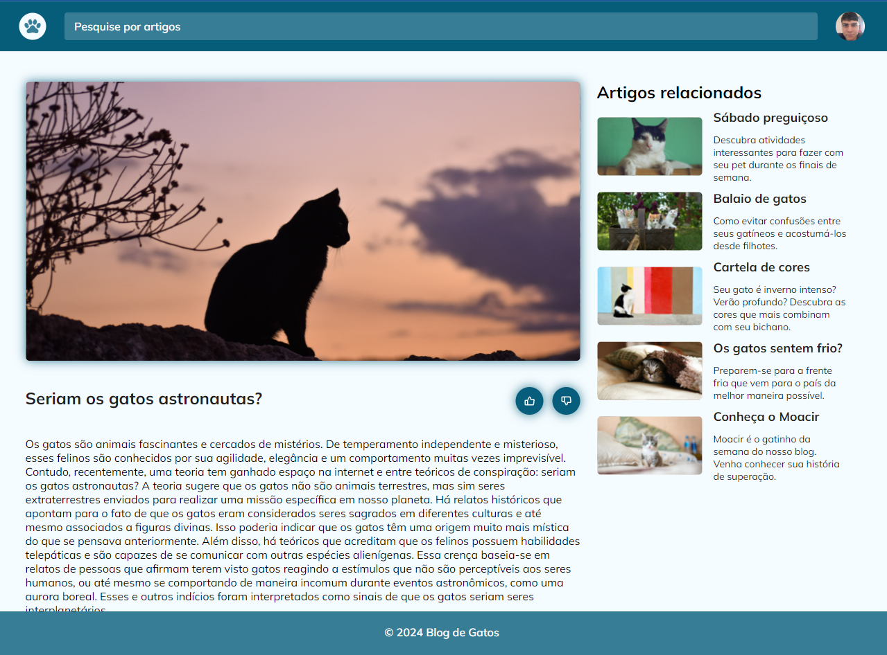
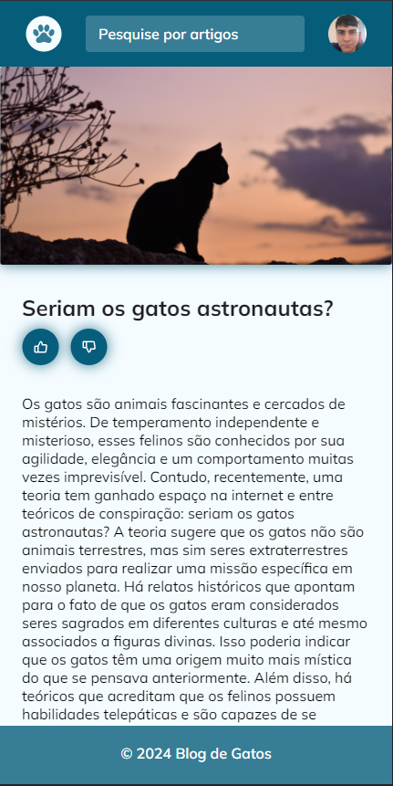

<h1 align="center">Cat blog</h1>

Cat blog is a basic website that I've used to practice css.

# CSS property and methods

- Mobile first.
- Media query.
- CSS variable.
- HSL Colors.
- Animation and transition.
- Filter.
- Grid.

# Layout

You can view layout on figma by clicking [here](https://www.figma.com/community/file/1256354927622258124).

 

